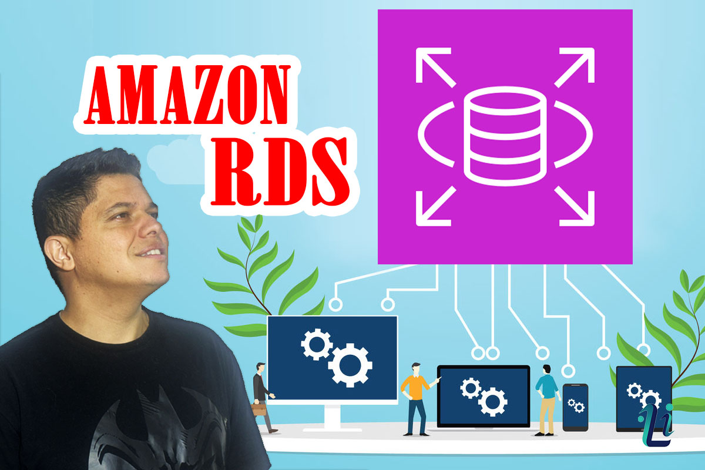
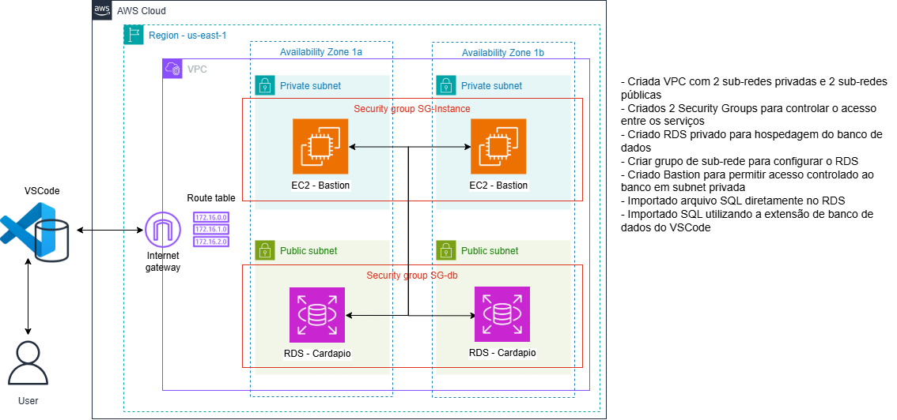

# ☁️ Projeto AWS RDS — Banco Privado com Bastion Host

Este projeto demonstra, na prática, a criação de um **banco de dados gerenciado no Amazon RDS**, utilizando uma **sub-rede privada**, acesso seguro via **Bastion Host** e execução de script SQL através do **VS Code**.

O objetivo é simular um cenário real de infraestrutura em nuvem, seguindo boas práticas de **segurança, rede e acesso controlado**. 🔐

---

## 🎯 Objetivo do Projeto

- Criar um banco de dados no **Amazon RDS**
- Utilizar **sub-rede privada** (sem acesso direto pela internet)
- Implementar acesso seguro via **Bastion Host**
- Conectar ao banco usando **VS Code**
- Importar e executar um **script SQL local**
- Demonstrar arquitetura segura na AWS

---

## 🏗️ Arquitetura

Abaixo está a arquitetura do projeto:

Estrutura do ambiente:

Internet → Bastion Host (EC2 pública) → Sub-rede privada → Amazon RDS

- O **RDS não possui acesso público**
- O acesso ocorre apenas via **Bastion Host**
- Comunicação segura dentro da **VPC**

---

## ☁️ Serviços AWS Utilizados

- Amazon RDS
- Amazon EC2 (Bastion Host)
- VPC (Virtual Private Cloud)
- Subnets Públicas e Privadas
- Security Groups
- Internet Gateway

---

## 💻 Ferramentas Utilizadas

- VS Code
- Extensão de Banco / SQL
- Extensão SSH para conexão segura
- Script SQL local

---

## 🔐 Segurança

Boas práticas aplicadas:

- Banco em **sub-rede privada**
- Sem acesso público ao RDS
- Conexão segura via Bastion Host
- Controle via Security Groups
- Arquitetura semelhante a ambientes corporativos

---

## 🚀 Etapas do Projeto

1. Criar VPC e sub-redes (pública e privada)
2. Criar Security Groups
3. Criar Bastion Host (EC2 pública)
4. Criar banco no Amazon RDS (privado)
5. Conectar via SSH usando Bastion Host
6. Conectar pelo VS Code usando extensão SSH
7. Importar o SQL local diretamente no banco
8. Validar estrutura do banco

---

## 📂 Estrutura do Repositório

/sql
 ├── database.sql
/imagens
 ├── imagem1.png
 ├── arquitetura.png
README.md

---

## ▶️ Vídeo do Projeto

Youtube: https://youtu.be/cGxMk-yE3to

Linkedin: https://www.linkedin.com/in/luiz-inhesta-341b4b311/

---

## 👨‍💻 Autor

**Luiz Augusto**  
Projeto prático de Cloud & AWS ☁️🚀  

---

## 📌 Observações

Este projeto tem fins educacionais e demonstra como implementar um banco seguro na AWS utilizando boas práticas de arquitetura e segurança.
